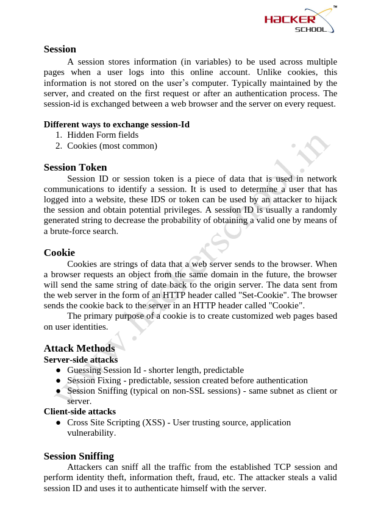
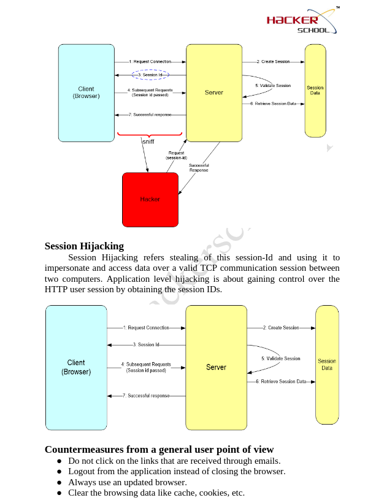
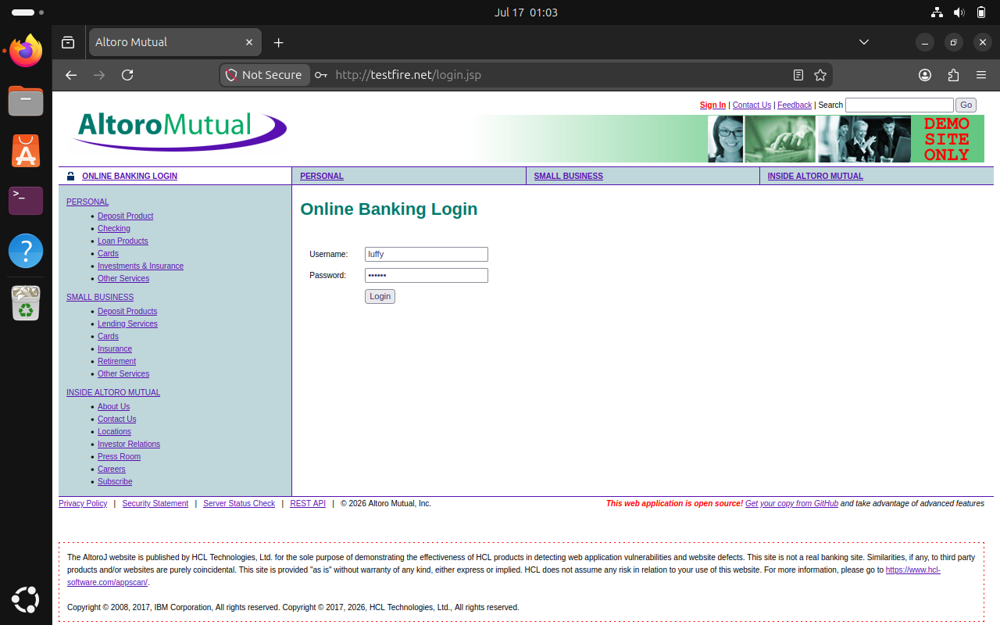
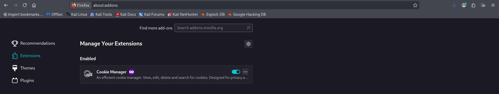
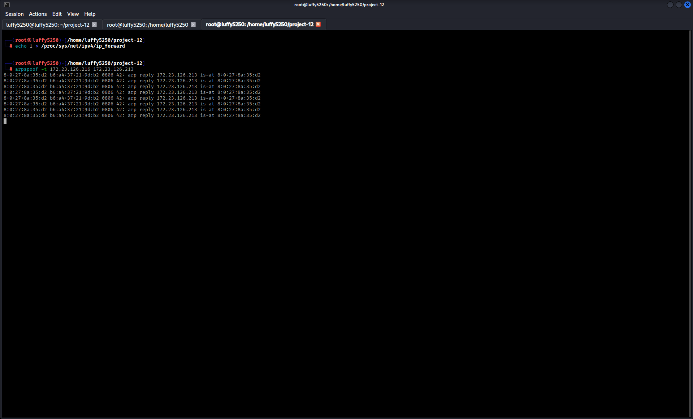
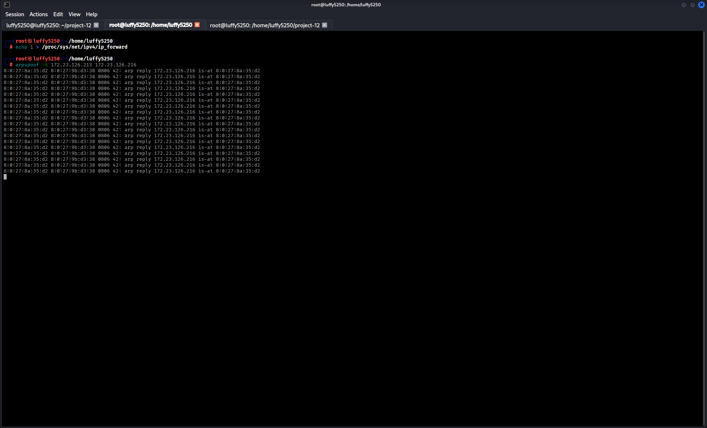
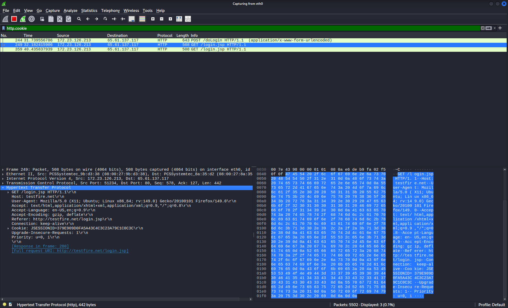

# Project 12. Session Hijacking

# Part 1 – Session Hijacking Fundamentals

## Objective

The main goal of this part is to understand how Session Hijacking works. This includes learning about session management, session identifiers, cookies and security best practices. These are the basics that we need to know before we can do the demonstrations that are covered later in this project.

---

# Session

When you use a website it needs to remember who you are. This is where a session comes in. A session is like a way that websites keep track of what you are doing on their site. The websites server keeps all the information about your session. This happens after you log in successfully. Every time you visit a page on the site your browser sends a special code to the server. This code is called the Session ID.

### Key Points

- The server is in charge of the session.

- A session starts after you log in.

- The Session ID is like a name tag that says who you are.

- The session ends when you log out or when it times out.

---

# Session ID (Session Token)

The Session ID is a code that the server gives you when you log in. This code is like a password that only the server and your browser know. When you visit a page your browser sends this code to the server so it knows who you are. You do not have to log in

### Characteristics

- The Session ID is randomly generated.

- Every time you log in you get a Session ID.

- The Session ID is used to say who you are.

- It is hard to guess what the Session ID is.

---

# Methods Used to Exchange Session IDs

Websites use ways to send Session IDs back and forth.

### Common Methods

- Hidden fields on forms

- Cookies which're the most common way

Cookies are used the most because your browser automatically sends them to the website every time you visit.

---

# Cookies

Cookies are pieces of information that the website stores on your browser. They help the website remember who you are and what you like. The website sends cookies to your browser. Then your browser sends them back to the website. This helps the website give you an experience.

### Purpose

- Cookies help the website remember who you are.

- They store your preferences.

- They help make the website more personal.



**Session Management Concepts**

```text

session-management-concepts.png

```

Take a look at Page 3 of the CEHv13 Session Hijacking module. It shows:

- What a session is

- What a Session ID is

- What a Session Token is

- What cookies are

- Different attack methods

- Session Sniffing

---

# Session Hijacking

Session Hijacking is when someone steals your Session ID and uses it to pretend to be you. If someone gets your Session ID they can get into your account without knowing your password.

### Objectives of an Attacker

- Steal Session IDs.

- Get around the login process.

- Get information.

- Pretend to be an user.



**Session Hijacking**

```text

session-hijacking-diagram.png

```

Take a look at Page 4 of the CEHv13 Session Hijacking module. It shows:

- What Session Hijacking is

- How to stop it

---

# Attack Methods

There are ways to do Session Hijacking. Some ways involve the server. Some involve the client.

### Server-Side Attacks

- Guessing Session IDs

- Session Fixation

- Session Sniffing

### Client-Side Attacks

- Cross-Site Scripting, which is also called XSS

---

# Session Sniffing

Session Sniffing is when someone listens in on your internet traffic to get your Session ID or cookies. If they get this information they can pretend to be you and get into your accounts.

This can lead to:

- Identity Theft

- Information Theft

- Fraud

- Getting into your accounts without permission

---

# Countermeasures

## General User Best Practices

- Do not click on links in emails.

- Always log out when you are done.

- Keep your browser up, to date.

- Clear your browsing data, including your cache and cookies.

## Web Developer Best Practices

- Make Session IDs that are hard to guess.

- Give a Session ID when someone logs in.

- Keep session data secret.

- End sessions when someone logs out.

- Use firewalls to block malicious traffic.

---

# Key Concepts Learned

- What a session is

- What a Session ID is

- What a Session Token is

- What cookies are

- What Session Hijacking is

- What Session Sniffing is

- What Session Fixation is

- What Cross-Site Scripting is (XXS)

- How to keep sessions secure

- How to stop Session Hijacking

---

# conclusion

In this part I learned how websites use Session IDs and cookies to remember who you are. 
I also learned how attackers can steal Session IDs and how to stop them. This will help me understand how to keep my accounts safe.

-------------------------------------------------------------------------------------------------------------------------------------------------


# Part 2 – Cookie Stealing with MITM Attack

## Objective

The goal of this project is to see how a Man-in-the-Middle attack can intercept internet traffic and expose cookies that are sent between a computer and a website in a laboratory setting.

> **Note:** I only did this project in a laboratory environment that was approved for educational purposes.

---

# Cookie Stealing with MITM Attack

In this project the attacker uses a trick called ARP spoofing to get in between the victim and the internet gateway. Once the internet traffic goes through the attackers computer they can look at the internet packets to see the cookies that the website sends.

---

# Lab Environment

| Machine | Role |


| Kali Linux | Attacker |

|Ubuntu | Victim |

| Firefox Browser | Web Browser |

| Wireshark | Packet Analysis |

| Cookie Manager | Browser Extension |

| arpspoof | MITM Tool |

---

# User Authentication

The victim logs into a website that's not secure while the attacker logs into a different account on the same website to make it look like a real laboratory setting.

**Victim Credentials**

```

Username: luffy

Password: naruto

```

Website:

```

http://testfire.net

```



**TestFire User Authentication**

```text

testfire-login-users.png

```

I took a picture of both the attacker and the victim successfully logging into the TestFire website.

---

# Installing Cookie Manager

I installed the Cookie Manager extension on the attackers computer. This extension lets me look at and manage cookies on the browser during the project.



**Firefox Cookie Manager Installation**

```text

firefox-cookie-manager-installation.png

```

I took a picture of the Firefox Add-ons page showing that Cookie Manager is installed.

---

# Performing ARP Spoofing

I turned on IP forwarding on the attackers computer.

```bash

echo 1 > /proc/sys/net/ipv4/ip_forward

```

Then I started the ARP spoofing attack.

```bash

arpspoof -t <router_ip> <victim_ip>

```

```bash

arpspoof -t <victim_ip> <router_ip>

```

These commands let the attackers computer get in between the victim and the internet gateway so they can see all the internet traffic.





**ARP Spoofing MITM Attack**

```text

arpspoof-mitm-attack.png

```

I took a picture of all three computer terminals showing IP forwarding and the ARP spoofing commands.

---

# Capturing HTTP Session Cookies

I started Wireshark on the attackers computer. Used a filter to look at the HTTP cookies.

```text

http.cookie

```

Then I refreshed the website on the victims computer to make it send some HTTP requests.

I looked at the packets that Wireshark captured and checked the HTTP section to see the cookies that the website sent.



**Wireshark HTTP Cookie Capture**

```text

ubuntu-wireshark-http-cookie-capture.png

```

I took a picture of Wireshark showing the HTTP Cookie header in the packet details.

---

# Observation

During this project I saw that:

- The ARP spoofing attack successfully got the attackers computer in between the victim and the internet gateway.

- The attacker could see the HTTP traffic between the victim and the website.

- The attacker could see the cookies that the website sent using HTTP.

- This project showed how session identifiers can be exposed when websites use HTTP.

---

# SOC Analyst Perspective

Security analysts watch for ARP spoofing attacks, strange network behavior and unencrypted HTTP communications that expose session identifiers. They use security measures like HTTPS secure cookies and network monitoring to reduce the risk of session hijacking attacks.

---

# Key Concepts Learned

- Session Hijacking

- Man-in-the-Middle attack

- ARP Spoofing

- HTTP Cookies

- Session Cookies

- Wireshark Packet Analysis

- Cookie-Based Authentication

- Network Traffic Analysis

---

# conclusion

In this project I learned how HTTP session cookies can be seen during a Man-in-the-Middle attack in a controlled laboratory environment. 
I also learned about the importance of session management using HTTPS for encrypted communication and monitoring techniques to protect websites against session hijacking attacks. 
Session Hijacking is an issue and Man-, in-the-Middle attacks can be used to steal Session Cookies.


------------------------------------------------------------------------------------------------------------------------------------------------------------------------------------------------------------------


# Final Summary

## Project Overview

This project taught me about managing web sessions. Showed me how session cookies can be seen by someone else when they are sent over the internet without any protection.

The project covered the basics of session management. Actually showed me how to do a Man-in-the-Middle attack using ARP spoofing and Wireshark to look at HTTP session cookies. This was all done in a controlled environment.

---

# Topics Covered

- Session

- Session ID

- Cookies

- Session Hijacking

- Session Sniffing

- Man-in-the-Middle

- ARP Spoofing

- HTTP Cookie Analysis

- Session Security

- Countermeasures

---

# Tools Used

- Kali Linux

- Ubuntu

- Firefox Browser

- Wireshark

- arpspoof

- Cookie Manager

---

# Skills Demonstrated

- I learned about managing sessions

- I was able to find session identifiers

- I did ARP spoofing in a controlled lab

- I used Wireshark to capture HTTP traffic

- I looked at HTTP Cookie headers

- I understood the risks of using HTTP without any security

- I applied concepts of security

---

# SOC Analyst Perspective

Session hijacking is often linked to web applications that are not secure using HTTP without encryption and Man-in-the-Middle attacks.

SOC analysts keep an eye out for:

- ARP spoofing

- HTTP traffic

- Sessions behaving strangely

- People trying to log in without permission

- Signs of session hijacking

To reduce these risks organizations:

- Use HTTPS

- Use secure cookies

- Use HttpOnly Cookies

- Use SameSite Cookies

- Divide their networks into segments

- Use systems to detect and prevent intrusions

- Keep a close eye on their networks all the time

---

# Key Takeaways

- Session IDs are like names for users who have logged in.

- Cookies help keep users logged in.

- If HTTP traffic is not encrypted session cookies can be exposed.

- ARP spoofing can be used to do Man-in-the-Middle attacks.

- Wireshark can be used to look at HTTP session traffic.

- Using HTTPS and secure cookies makes it much harder for session hijacking to happen.

---

# conclusion

From this project I got an understanding of managing sessions, HTTP cookies and the risks of using the web without security. I also got to practice analyzing HTTP traffic using Wireshark. 
Learned how network defenders find and stop session hijacking attacks, in big organizations.
